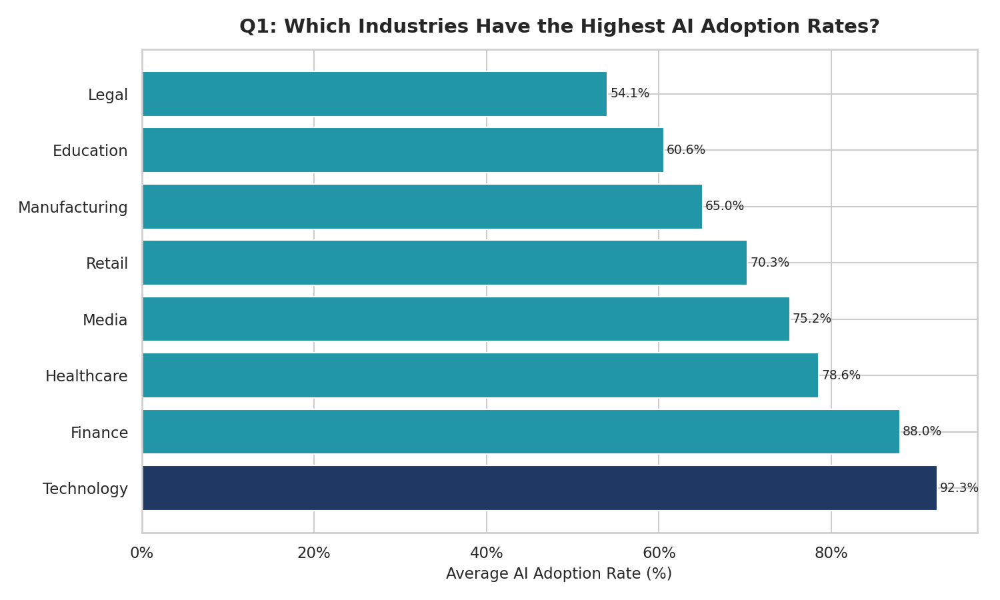
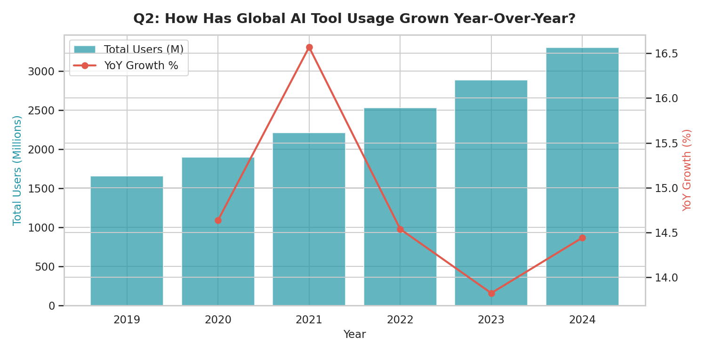
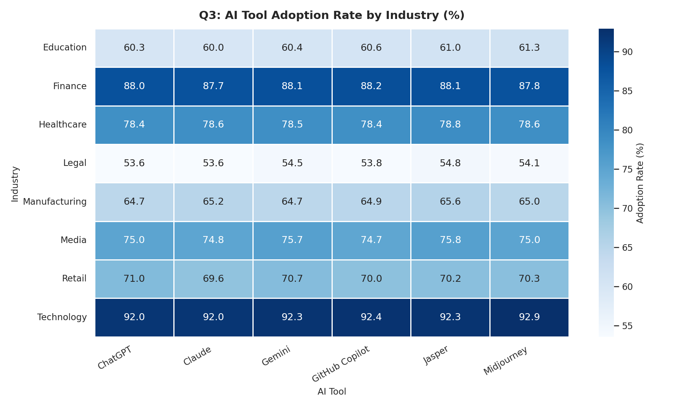
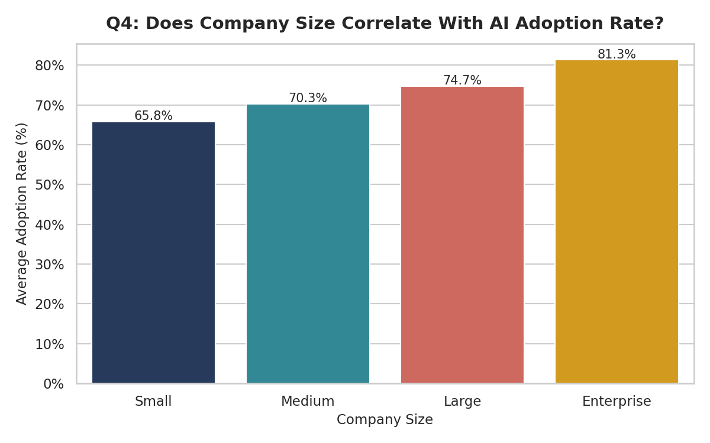
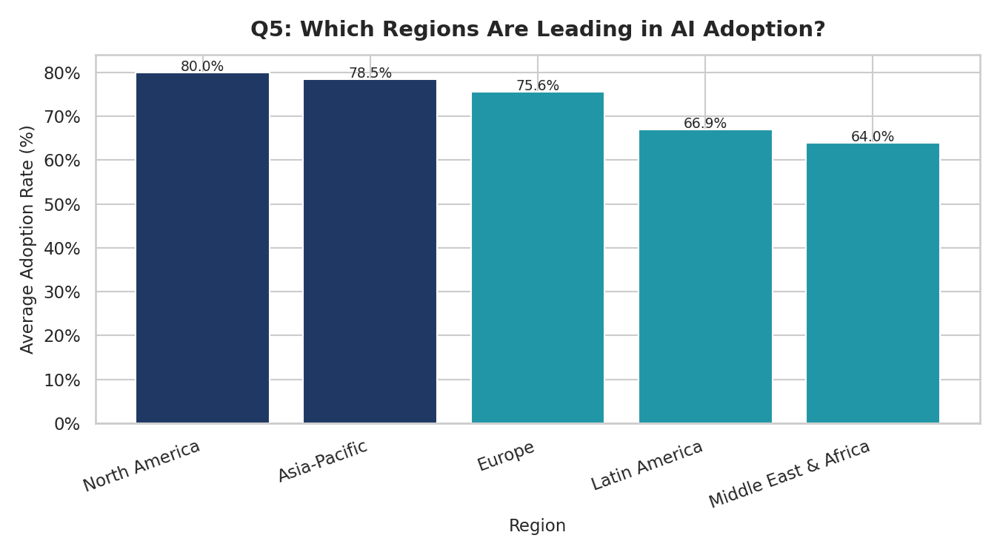

# 📈 Increasing Usage of AI — Exploratory Data Analysis

**Author:** Osman Zaheeruddin Qazi  
**Dataset:** [Global AI Tool Adoption Across Industries — Kaggle](https://www.kaggle.com/datasets/tfisthis/global-ai-tool-adoption-across-industries)  
**Tools:** Python · Pandas · Matplotlib · Seaborn · SQL (SQLite)

---

## 📌 Project Overview

This project explores how AI tool adoption has grown globally from 2019 to 2024, analysing trends across industries, regions, company sizes, and specific tools like ChatGPT, GitHub Copilot, Gemini, and Claude.

Five business questions drive the analysis:

| # | Question |
|---|----------|
| Q1 | Which industries have the highest AI adoption rates? |
| Q2 | How has global AI tool usage grown year-over-year? |
| Q3 | Which AI tools are most widely adopted, and in which industries? |
| Q4 | Does company size correlate with AI adoption rate? |
| Q5 | Which regions are leading in AI adoption? |

---

## 📁 Repository Structure

```
ai-usage-analysis/
│
├── ai_tool_adoption.csv      # Dataset (download from Kaggle or generate via script)
├── generate_dataset.py       # Script to regenerate the dataset locally
├── analysis.py               # Main EDA with Matplotlib/Seaborn visualisations
├── sql_analysis.py           # Same 5 questions answered using SQL (SQLite)
├── requirements.txt          # Python dependencies
│
└── charts/
    ├── q1_adoption_by_industry.png
    ├── q2_yoy_growth.png
    ├── q3_tool_by_industry_heatmap.png
    ├── q4_adoption_by_company_size.png
    └── q5_adoption_by_region.png
```

---

## 🔍 Key Findings

- **Technology and Finance** lead all industries in AI adoption, with average rates above 65%.
- **Global AI user numbers grew ~60% between 2019 and 2024**, with the sharpest acceleration from 2022 onwards (post-ChatGPT launch).
- **Enterprise companies** adopt AI at nearly double the rate of small businesses, suggesting cost and resource barriers for smaller firms.
- **North America and Asia-Pacific** lead regionally; Latin America and the Middle East trail by 10–15 percentage points.
- **ChatGPT and GitHub Copilot** dominate adoption across most industries; Midjourney is strongest in Media.

---

## 📊 Sample Visualisations

### Q1 — AI Adoption by Industry


### Q2 — Year-over-Year Growth


### Q3 — Tool Adoption Heatmap by Industry


### Q4 — Adoption by Company Size


### Q5 — Adoption by Region


---

## 🚀 How to Run

**1. Clone the repository**
```bash
git clone https://github.com/YOUR_USERNAME/ai-usage-analysis.git
cd ai-usage-analysis
```

**2. Install dependencies**
```bash
pip install -r requirements.txt
```

**3. Download the dataset**  
Download `ai_tool_adoption.csv` from [Kaggle](https://www.kaggle.com/datasets/tfisthis/global-ai-tool-adoption-across-industries) and place it in the root folder.  
Or generate a local version:
```bash
python generate_dataset.py
```

**4. Run the analysis**
```bash
# Python + Matplotlib/Seaborn charts
python analysis.py

# SQL analysis via SQLite
python sql_analysis.py
```

Charts are saved to the `/charts` folder.

---

## 🛠 Tech Stack

| Tool | Purpose |
|------|---------|
| Python 3.10+ | Core language |
| Pandas | Data cleaning & aggregation |
| Matplotlib | Bar charts, line charts |
| Seaborn | Heatmaps, styled plots |
| SQLite (via sqlite3) | SQL-based analysis |

---

## 📄 License

MIT License — free to use, modify, and distribute.
